# Get Stuff Done

> > An application that makes managing your tasks easy.

### Technologies

`React Native` `Firebase`

### Screenshots

<h6>
#1 Login Screen | #2 Register Screen | #3 Tasks Screen | #4 Tasks(today) | #5 Tasks(completed) | #6 Tags Screen | #7 Drawer | #8 Add Task(select date) | #9 Add Task(select tags) | #10 Edit Task | #11 Action on a Task | #12 Tasks of selected tag
</h6>

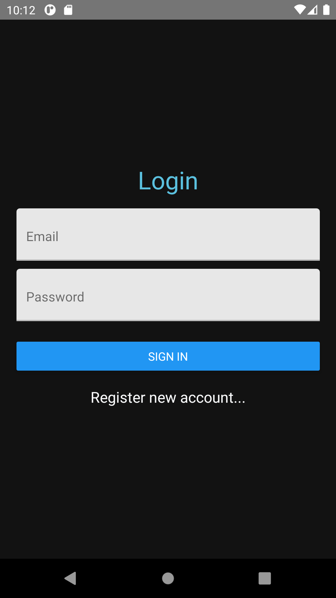
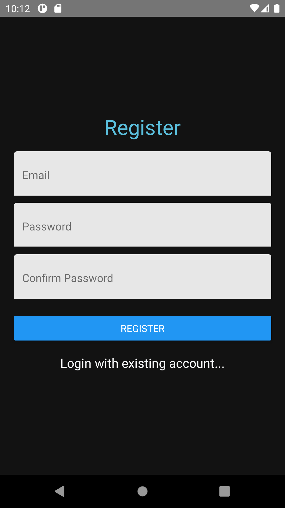
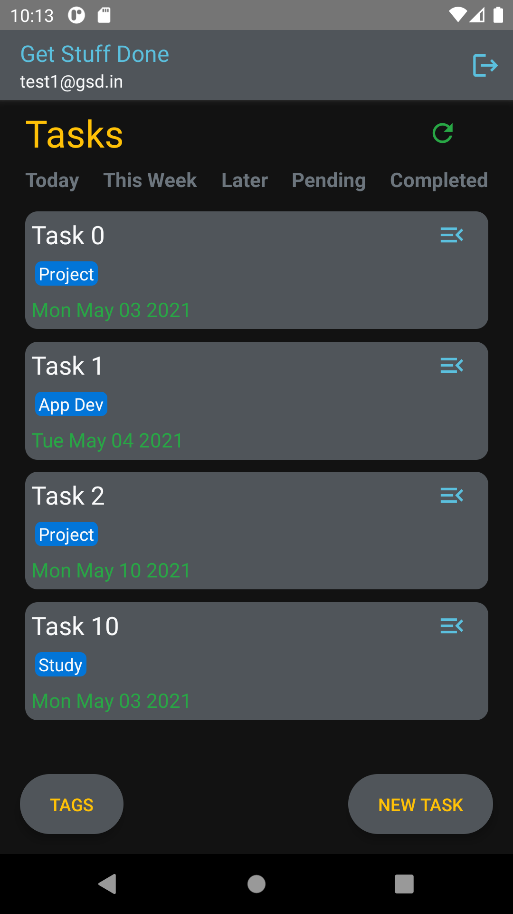
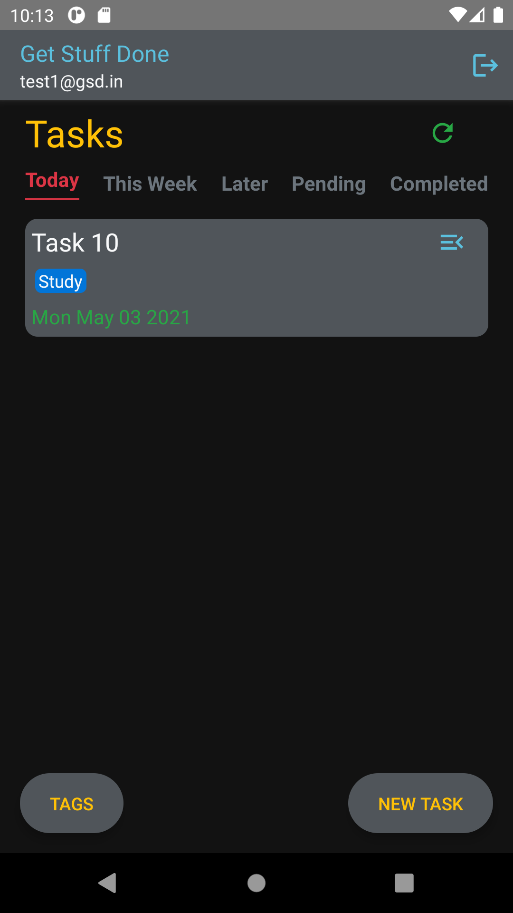
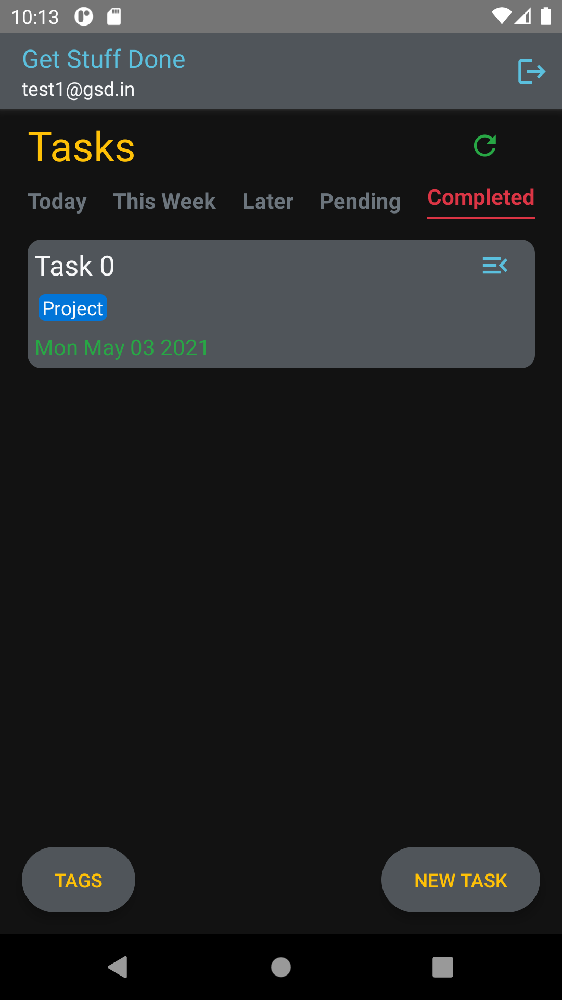
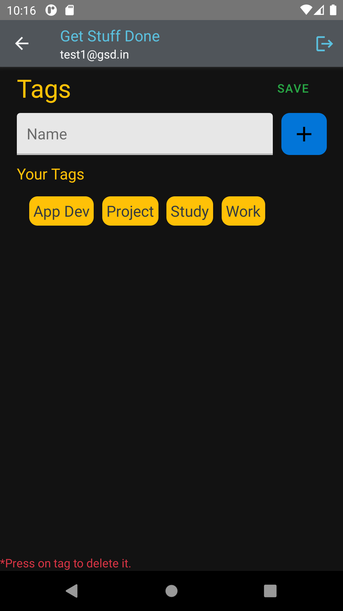
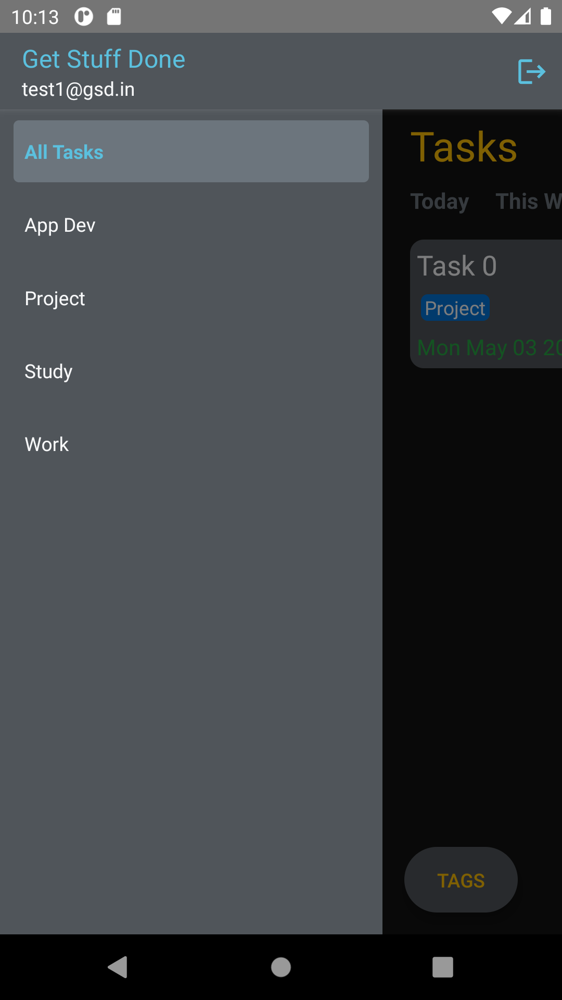
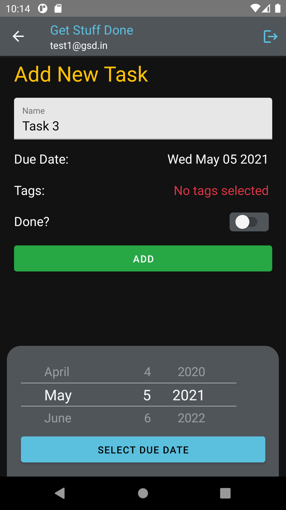
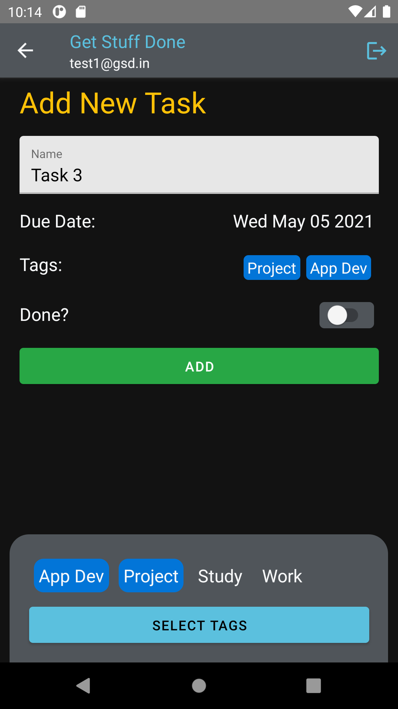
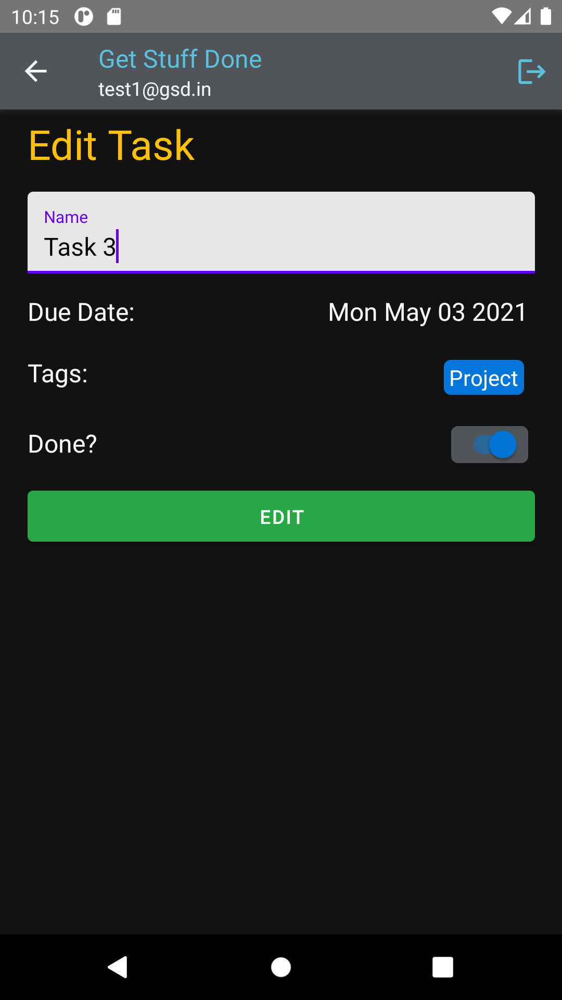
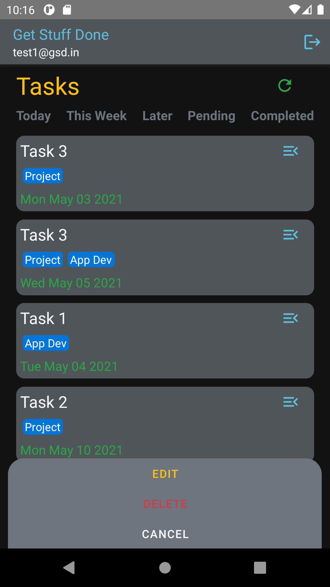
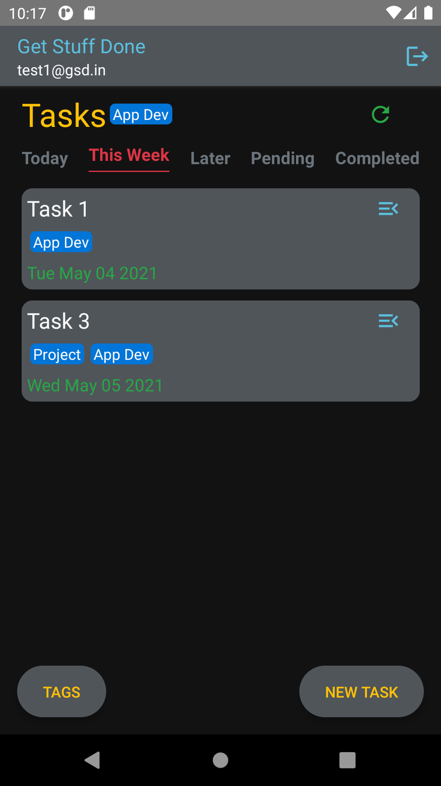

